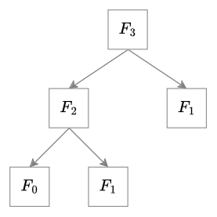
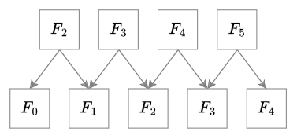

# 알고리즘 분석 - 피보나치 수열(Fibonacci Sequence)

피보나치 수열은, 유명한 점화식 수열 중 하나입니다. 피보나치 수열의 비율이 수렴하는 값은 황금비(golden ratio), $\dfrac{1 + \sqrt 5}{2}$로 알려져 있습니다. 피보나치 수열은 다음과 같이 점화식으로 정의될 수 있습니다.

```math
F_n
\begin{cases} \\
0 & \text{if } n = 0, \\
1 & \text{if } n = 1, \\
F_{n - 2} + F_{n - 1} & \text{if } n \geq 2
\end{cases}
```


피보나치 수열 계산 알고리즘을 C언어로 구현하면 다음과 같이 구현할 수 있습니다.

```c
#include <stdint.h>

uint64_t fibonacci(uint64_t n) {
    if (n == 0) {
        return 0;
    }
    if (n == 1) {
        return 1;
    }
    return fibonacci(n - 2) + fibonacci(n - 1);
}
```

수학적 정의와 동일하게 구현한 알고리즘입니다. 이 알고리즘으로 매개변수 $n$에 어느 정도 큰 값(약 $30$ 이상)을 대입하면 연산 결과가 갑자기 느려지는 것을 경험할 수 있습니다. 이 알고리즘의 시간 복잡도를 계산하면서 개선할 수 있는 부분을 알아봅니다.

## 시간 복잡도 분석




도식을 참고하면, $F_3$을 계산하기 위해, $F_{1}$을 두 번 계산하는 것을 알 수 있습니다. 귀납적으로 어림잡아 $F_n$을 계산하기 위해, $F_{n - 2}$를 두 번 계산할 테니, 시간 복잡도 함수가 $2^{n - 2}$에 비슷하게 근사될 것이라고 짐작할 수 있고, 이때 시간 복잡도를 $O(2^n)$으로 평가할 수 있겠습니다. 수학적 증명을 참고하여 실제로 $O(2^n)$으로 근사할 수 있는지 확인할 수 있습니다.

### 엄밀한 시간 복잡도 함수 계산

기본적인 정수 값의 사칙연산과 대소 비교 등의 연산은 시간 복잡도를 $O(1)$으로 가정합니다. 따라서 $n$이 $0$과 $1$일 때 시간 복잡도 함수 $T(n)$은 다음과 같이 정리할 수 있습니다.

```math
T(n) =
\begin{cases} \\
1 & \text{if } n = 0 \\
1 & \text{if } n = 1
\end{cases}
```

$2$ 이상의 $n$에 대해서, 함수 $T(n)$은 재귀적으로 $T(n - 2) + T(n - 1)$로 정의할 수 있습니다. 마찬가지로 $T(n + 1)$은 $T(n - 1) + T(n)$으로 정의할 수 있습니다. 이를 일반화하기 위해 다음과 같이 점화식에서 $n$에 대한 식으로 바꿉니다.

먼저 $T(n)$, $T(n + 1)$, $T(n + 2)$는 다음과 같은 관계식으로 표현할 수 있습니다.

```math
\begin{equation}
\dfrac{T(n + 2)}{T(n + 1)} = 1 + \dfrac{T(n)}{T(n + 1)}
\end{equation}
```

이때 $U(n) = \dfrac{T(n)}{T(n + 1)}$으로 치환하면 등식 $(1)$은 다음처럼 표현할 수 있습니다.

```math
\dfrac{1}{U(n + 1)} = 1 + U(n)
```
```math
\begin{equation}
1 = U(n + 1) + U(n)U(n + 1)
\end{equation}
```

위의 등식을 조정해서 임의의 실수 $a$와 $b$에 대해 다음이 성립한다고 가정합니다.

```math
1 + aU(n + 1) = bU(n + 1)\{1 + aU(n)\} \\
```

그렇다면 실수 $a$, $b$는 다음을 만족합니다.

```math
ab = 1, \ b - a = 1 \Longleftrightarrow x^2 + (b - a)x - ab = x^2 + x - 1 = 0
```

위의 방정식을 만족하는 두 근을 $\alpha$, $\beta$로 가정합니다.

새로운 함수 $V(n) = 1 + aU(n)$는 다음 등식이 성립합니다.

```math
\begin{equation}
V(n + 1) = bU(n + 1)V(n)
\end{equation}
```
```math
\begin{align}
V(n + 1) \cdot T(n + 2) &= bV(n) \cdot \dfrac{T(n + 1)}{T(n + 2)} \cdot T(n + 2) \\
&= bV(n)T(n + 1)
\end{align}
```

위의 등식에 따라 $V(n)T(n + 1)$는 공비가 $b$인 등비 수열의 점화식으로 표현될 수 있음을 확인할 수 있습니다. 따라서 $V(n)T(n + 1)$를 일반화하면 다음과 같습니다.

```math
\begin{align}
V(n)T(n + 1) &= \left\{ 1 + a\frac{T(n)}{T(n + 1)} \right\} \cdot T(n + 1) \\ 
&= T(n + 1) + aT(n) \\
&= b^n \left\{ T(1) + aT(0) \right\}
\end{align}
```

방정식 $x^2 - x - 1$의 두 근이 $\alpha$, $\beta$임을 활용하여 대입해 보면, 다음과 같습니다.

```math
\begin{align}
T(n + 1) + \alpha T(n) = (-\beta)^n \left\{ T(1) + \alpha T(0) \right\} \\
T(n + 1) + \beta T(n) = (-\alpha)^n \left\{ T(1) + \beta T(0) \right\}
\end{align}
```

두 등식을 연립 방정식으로 $T(n)$을 구할 수 있습니다.

```math
(\alpha - \beta)T(n) = (-\beta)^n \left\{ T(1) + \alpha T(0) \right\} - (-\alpha)^n \left\{ T(1) + \beta T(0) \right\}
```

$\alpha - \beta \neq 0$이므로 계속해서 $T(n)$을 구할 수 있습니다.

```math
T(n) =  (-\beta)^n \dfrac{ T(1) + \alpha T(0)}{\alpha - \beta} - (-\alpha)^n \dfrac{T(1) + \beta T(0)}{\alpha - \beta}
```

$\alpha$, $\beta$에 방정식 $x^2 + x - 1$의 두 근 $\dfrac{-1 \pm \sqrt 5 }{2}$를 대입하여 $T(n)$을 구합니다.

```math
T(n) = \dfrac{1}{\sqrt 5} \left( \dfrac{1 + \sqrt 5}{2} \right)^{n + 1} - \dfrac{1}{\sqrt 5} \left( \dfrac{1 - \sqrt 5}{2} \right)^{n + 1}
```

### 엄밀한 대문자 O 표기법 근사

먼저, 시간 복잡도 함수 $T(n)$은 $n \geq 0$의 구간에서 항상 양수이므로, 대문자 O 표기법으로 근사할 수 있습니다. $T(n)$을 근사하기 위해 다음과 같이 $T(n)$을 설정합니다.

```math
T_1(n) = \dfrac{1}{\sqrt 5} \left( \dfrac{1 + \sqrt 5}{2} \right)^{n + 1} \\ 
T_2(n) = - \dfrac{1}{\sqrt 5} \left( \dfrac{1 - \sqrt 5}{2} \right)^{n + 1} \\ 
T(n) = T_1(n) + T_2(n)
```

$T_2(n)$는 모든 자연수 $n$에 대해서 항상 양수가 아닐 수 있으므로, $T_2(n)$가 음수가 되는 경우를 분리하여 따로 살펴 봅니다. 

1. $n$이 짝수 $2k$일 경우, $T_2(n) = -\dfrac{1}{\sqrt 5} \left( \dfrac{1 - \sqrt 5}{2} \right)^{2k + 1}$로 $T(n)$은 항상 양수입니다.

2. $n$이 홀수 $2k + 1$일 경우, $T_2(n) = -\dfrac{1}{\sqrt 5} \left( \dfrac{1 - \sqrt 5}{2} \right)^{2k + 2}$로 음수가 됩니다. 따라서 $T_1(n)$과 합한 결과가 양수인지 확인하면 됩니다. $T_1(n) + T_2(n) = \dfrac{1}{\sqrt 5} \left( \dfrac{3 + \sqrt 5}{2} \right)^{k + 1} - \dfrac{1}{\sqrt 5} \left( \dfrac{3 - \sqrt 5}{2} \right)^{k + 1} > 0$으로 양수입니다. 따라서 이 경우에도 $T(n)$은 양수입니다.

$O(T(n)) = O(\max(T_1(n), T_2(n)))$이므로, $O(T(n)) = O(T_1(n))$으로 근사할 수 있습니다. $O(T_1(n))$은 $O(\dfrac{3 + \sqrt 5}{2 \sqrt 5} 2^{n \log_2{ \frac{3 + \sqrt 5}{2}}})$이므로 $O(2^n)$으로 근사할 수 있습니다.

## 선형 시간 복잡도 알고리즘

재귀 알고리즘으로 구현한 알고리즘의 문제점은, 동일한 계산 결과를 중복해서 계산한다는 점입니다. 또한 중간 결과를 두 개만 기억하면 되므로, 과감하게 그 이전의 중간 결괏값을 버릴 수 있습니다.



도식을 참고하면, $2$ 이상의 정수 $n$에 대해서, $F_n$은 미리 계산된 $F_{n - 1}$과 $F_{n - 2}$가 필요합니다. 재귀적으로 $F_n$을 계산할 때 $F_{n - 1}$을 계산하는 중에 중복해서 $F_{n - 2}$를 계산할 필요가 없습니다.

C언어로 구현하면 다음과 같습니다.

```c
#include <stdint.h>

uint64_t fibonacci(uint64_t n) {
    if (n == 0) {
        return 0;
    }
    if (n == 1) {
        return 1;
    }
    uint64_t prev2 = 0;
    uint64_t prev1 = 1;
    for (uint64_t i = 2; i <= n; ++i) {
        uint64_t next = prev2 + prev1;
        prev2 = prev1;
        prev1 = next;
    }
    return prev1;
}
```

### 시간 복잡도 분석

$2$ 이상의 자연수 $n$에 대해서 항상 $n - 1$의 연산을 수행하므로, 이 알고리즘의 시간 복잡도 함수 $T(n)$은 $O(n - 1) = O(n)$으로 근사할 수 있습니다.

## 상수 시간 복잡도 알고리즘

엄밀히 말해서, 최악 시간 복잡도는 선형 시간이지만, 평균, 최적 시간 복잡도를 $O(1)$으로 근사할 수 있는 방법이 있습니다. 피보나치 수열 $F_n$은 $n$번째 항에 대해서 항상 같은 값이므로 과감하게 $n$번째 항의 계산 결과를 기록하는 법입니다. 64비트 부호 없는 정수 자료형의 경우, $F_{93}$까지 계산할 수 있으므로, 연산 결과를 기록하고, 기록되지 않은 연산 결과에 한해서 연산을 수행하는 방식으로 진행합니다. 이때 계산 방법은 선형 시간 알고리즘을 활용합니다. 

```c
#include <stdint.h>
#include <stdio.h>

#define FIBONACCI_BOUND 94

uint64_t *initialize_cache(void) {
    static uint64_t cache[FIBONACCI_BOUND];
    cache[0] = 0;
    cache[1] = 1;
    for (uint64_t i = 2; i < FIBONACCI_BOUND; ++i) {
        cache[i] = UINT64_MAX;
    }
    return cache;
}

uint64_t fibonacci(uint64_t n) {
    static uint64_t *cache = NULL;
    if (cache == NULL) {
        cache = initialize_cache();
    }
    if (cache[n] != UINT64_MAX) {
        return cache[n];
    }
    cache[n] = fibonacci(n - 2) + fibonacci(n - 1);
    return cache[n];
}
```

코드만 얼핏 보면 재귀 알고리즘과 유사한 형태지만, 실제 알고리즘이 수행하는 계산 과정을 살펴보면 `fibonacci(n - 2)`를 `fibonacci(n - 1)`보다 우선 계산하므로 `fibonacci(n - 1)`를 계산할 시점에 `fibonacci(n - 2)`는 $O(1)$으로 계산을 끝낼 수 있습니다. 만약 `fibonacci(n - 2)`가 계산돼 있지 않아 추가적으로 계산하는 경우, 이때의 시간 복잡도 함수 $T(n)$은 $n - 2$에 대해서 $T(n - 2) = T(n - 3) + 1$이므로, 재귀적으로 $T(n - 2) = n - 3 + T(0) + 1 = n - 1$임을 알 수 있습니다. 따라서 $O(T(n)) = O(n)$이 성립함을 알 수 있습니다.

----

[목차](./readme.md)
