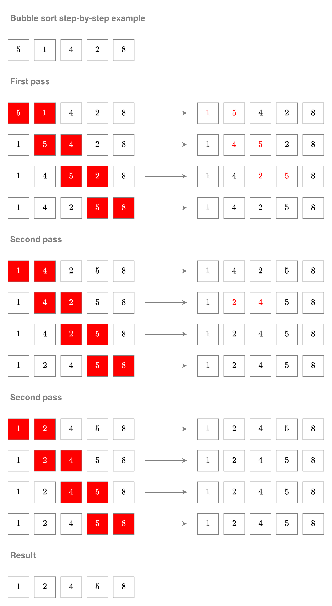

# 버블 정렬(Bubble Sort)

버블 정렬, 또는 거품 정렬은 구현 난이도가 간단한 정렬 알고리즘 중 하나입니다. 정렬 알고리즘의 이름은 배열의 큰 값의 요소가 거품처럼 떠오른다고 하여 붙여졌습니다. 버블 정렬은 성능이 탁월하지 않아 실제 상황에서 자주 쓰이지 않는 알고리즘이며, 주로 교육 과정에서 다루는 알고리즘입니다.


버블 정렬 애니메이션, Wikipedia

## 버블 정렬 알고리즘 설명

버블 정렬 알고리즘에서, 배열에서 인접한 두 요소가 정렬 순서에 맞지 않으면 서로 자리를 교체합니다. 교체하고 난 다음, 다음 순서로 이동하여 같은 과정을 배열 처음 두 요소부터 마지막 두 요소까지 같은 과정을 반복합니다. 이 전체 과정을 '1회차'로 정합니다. 한 회차에서 자리를 교체한 요소가 없다면 정렬된 상태를 나타내므로 알고리즘을 종료합니다.

 Wikipedia 예시 인용, 그래픽 재제작

## 버블 정렬 알고리즘 성능

버블 정렬 알고리즘은 최악 또는 평균 시간복잡도 $O(n^2)$의 성능으로 작동합니다. 다른 보편적인 정렬 알고리즘의 최악 또는 평균 시간복잡도가 $O(n \log n)$인 것에 비하면 상당히 효율적인 알고리즘이 아닙니다.

버블 정렬 알고리즘 수행 과정 중 한 회차에서 인접한 두 요소를 비교하고, 자리를 교체하는 연산을 배열의 처음부터 끝까지 적용하므로, 한 회차의 시간복잡도 $T_1(n)$은 배열의 요소 개수 $n$에 대해서 $n - 1$로 표현할 수 있습니다. 이어서 한 회차를 모든 요소가 정렬될 때까지 반복하므로, 정렬 순서와 반대인 배열의 경우를 예를 들어 계산해 보면, $n$개의 요소가 위치를 바꾸어야 하므로 최대 $n$번 반복해야 합니다. 따라서 회차를 반복하는 연산의 시간복잡도 $T_2(n)$는 배열의 요소 개수 $n$에 대해서 $n$으로 근사할 수 있습니다. 따라서 버블 정렬 알고리즘의 전체 시간복잡도는 $O(T_1 \cdot T_2) = O(n^2 - n) = O(n^2)$으로 표현할 수 있습니다.

## 버블 정렬 알고리즘 구현

```c
#include <stdbool.h>
#include <stdint.h>

int32_t *bubble_sort(int32_t *xs, size_t length) {
    if (xs == NULL || length < 2) {
        return xs;
    }
    bool sorted = false;
    while (!sorted) {
        sorted = true;
        for (size_t i = 1; i < length; ++i) {
            int32_t temp;
            if (xs[i - 1] > xs[i]) {
                temp = xs[i - 1];
                xs[i - 1] = xs[i];
                xs[i] = temp;
                sorted = false;
            }
        }
    }
    return xs;
}
```

도식과 구현을 분석하면, 버블 정렬 알고리즘의 $n$번째 회차를 수행하면 $n$번째로 큰 값의 자리가 정해지는 것을 알 수 있습니다. 따라서 매 회차마다 $n - 1$번 요소를 비교하지 않고, $i$번째 회차에서 $n - i$번째 요소까지 비교하는 것으로 성능을 개선할 수 있습니다. 이때 알고리즘의 시간복잡도를 계산하면 다음과 같습니다.

```math
\begin{align}
\sum_{i = 1}^{n} (n - i) &= \sum_{i = 1}^{n} n - \sum_{i = 1}^{n} i \\
&= n^2 - \dfrac{n^2 + n}{2} \\
& = \dfrac{n^2 - n}{2}
\end{align}
```

개선된 알고리즘 대문자 O 표기법으로 $O(n^2)$이지만, 시간복잡도 함수끼리 비교하면 개선된 알고리즘이 기존 알고리즘보다 약 2배 더 빠른 성능으로 작동한다는 것을 확인할 수 있습니다.

개선된 알고리즘으로 구현하면 다음과 같습니다.

```c
#include <stdbool.h>
#include <stdint.h>

int32_t *bubble_sort(int32_t *xs, size_t length) {
    if (xs == NULL || length < 2) {
        return xs;
    }
    size_t count = length;
    while (count > 0) {
        bool sorted = true;
        for (size_t i = 1; i < count; ++i) {
            int32_t temp;
            if (xs[i - 1] > xs[i]) {
                temp = xs[i - 1];
                xs[i - 1] = xs[i];
                xs[i] = temp;
                sorted = false;
            }
        }
        if (sorted) {
            break;
        }
        --count;
    }
    return xs;
}
```

----

[목차](../readme.md)
