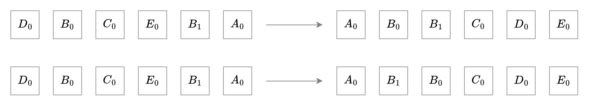

# 정렬 알고리즘(Sorting Algorithms)

정렬 알고리즘은 임의의 배열의 요소를 일정한 순서로 재배치하는 것입니다. 대표적인 정렬 순서로는 오름차순과 내림차순, 번호순, 사전순 등이 있습니다.

정렬 알고리즘을 분류하는 특징에는 여러가지가 있습니다. 

- 기억 장치 사용

    어떤 정렬 알고리즘은 수행하기 위해 추가적인 공간이 필요하기도 합니다. 추가 기억 장치가 필요하지 않은 알고리즘을 **제자리 알고리즘**(in-place alogrithms)이라고 합니다. 엄밀한 제자리 알고리즘은 추가 기억 장치의 공간 복잡도가 $O(1)$인 알고리즘을 말하지만, 일반적인 경우 공간 복잡도가 $O(\log n)$인 경우도 포함합니다.

- 안정성(stability)

    정렬 알고리즘에서 안정성이란, 순서 상 동일한 요소가 초기에 입력한 순서대로 순서를 유지하는 것을 말합니다. 

    

    그림을 보면 동일한 상태의 배열이 각각 왼쪽 초기 상태에서 알파벳 오름차순으로 오른쪽의 상태로 정렬됩니다. 초기 입력으로 $B_0$, $B_1$이 차례로 들어온 것을 확인할 수 있습니다. 위의 정렬 결과에서는 $B_0$, $B_1$이 입력 순서대로 순서를 유지하였으므로 안정성이 보장된 알고리즘이라고 할 수 있습니다. 반대로 아래의 정렬 결과에서 $B_0$, $B_1$의 순서가 입력 순서와 다르므로 아래의 정렬 알고리즘은 안정성이 보장된 알고리즘이라고 할 수 없습니다.

    정렬 알고리즘의 안정성은 프로그램 작성 시 중요한 요소입니다. 순서가 없는 어떤 자료형을 정렬하려면 대소 관계를 비교할 수 있는 키(key)를 선택하거나, 계산하여 정렬 순서에 활용합니다. 이때 키 이외의 값이 요소마다 서로 다르고, 안정성이 보장돼 있지 않다면 각 요소의 값을 사용하는 데 있어서 추가적인 검사가 필요할 것입니다. 예를 들어, 이름순으로 정렬된 학생 목록에서 학점이 4.0 이상인 학생에게 장학금을 주기 위해 목록을 뽑아냅니다. 이때 학점을 내림차순으로 정렬하면 적은 탐색 비용으로 학점이 4.0 이상인 학생을 추려낼 수 있을 것입니다. 단순히 4.0 이상의 학생만 추려낸다면 정렬 알고리즘의 안정성은 필요없을 것입니다. 하지만 이름으로 정렬된 상태가 필요하다면 안정성이 있는 알고리즘을 사용하거나, 추려낸 목록에서 이름을 키로 삼아 다시 정렬을 수행해야 할 것입니다.

## 정렬 알고리즘 분석

- [버블 정렬](./정렬-알고리즘-버블-정렬.md)
- [선택 정렬](./정렬-알고리즘-선택-정렬.md)
- [삽입 정렬](./정렬-알고리즘-삽입-정렬.md)
- [합병 정렬](./정렬-알고리즘-합병-정렬.md)
- [셸 정렬](./정렬-알고리즘-셸-정렬.md)
- [퀵 정렬](./정렬-알고리즘-퀵-정렬.md)
- [힙 정렬](./정렬-알고리즘-힙-정렬.md)
- [팀 정렬](./정렬-알고리즘-팀-정렬.md)
- [기수 정렬](./정렬-알고리즘-기수-정렬.md)

----

[목차](../readme.md)
